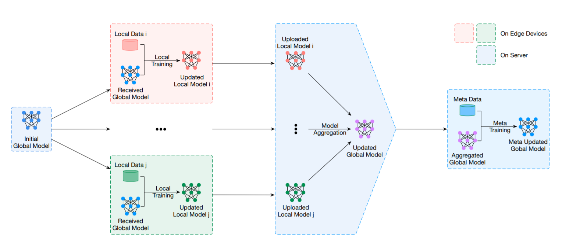
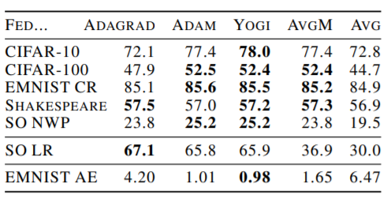
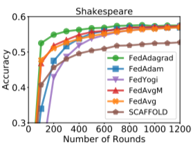
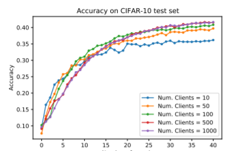

# Federated Learning

Implementation of federated learning algorithms for multi-class classification on CIFAR dataset.

Federated learning is a method for training a model on multiple machines. It is a combination of the following steps:

    1. **Client**: A client machine is a machine that is connected to a server. The client machine sends data/gradient updates to the server.
    2. **Server**: A server machine is a machine that is connected to other clients. The server machine receives data/gradient updates from the clients.
    3. **Model**: A model is a collection of weights and biases. Model can be global or local.
    4. **Optimizer**: An optimizer is a function that updates the global model based on the gradients computed by backpropagation on the clients.



## Setup

Just run the following command to install the dependencies:

```shell
pip install -r requirements.txt
```

then, to run the FL example on CIFAR10 dataset, run the following command:

```shell
run-all.bat
```

Following configurations can be done:

- Number of clients: change `NUM_CLIENTS` variable in `run_all.py`

- Number of FL Rounds: change `NUM_ROUNDS` variable in `config.py`

- Fraction of population that will be fit: change `FRACTION_FIT` variable in `config.py`

- Fraction of population that will be evaluated: change `FRACTION_EVAL` variable in `config.py`

- Change Device (CPU:"cpu"/GPU:"cuda"): change `DEVICE` variable in `config.py`

- other customizations:
  - changing the aggregation function in `server.py`

  - changing the Fedarated Optimizers in `server.py`. Try out FedAvg, FedAdam, FedYogi, & many others available in flwr framework.

  - Change the heterogeneous topology in `server.py`

## Results








## References

- [Report](https://drive.google.com/file/d/1Lz_xJSLXL4bYeplntQCEpitRdVdCAP77/view?usp=sharing)

- [Flwr Framework](https://flower.dev/)

- references to other papers in the report.